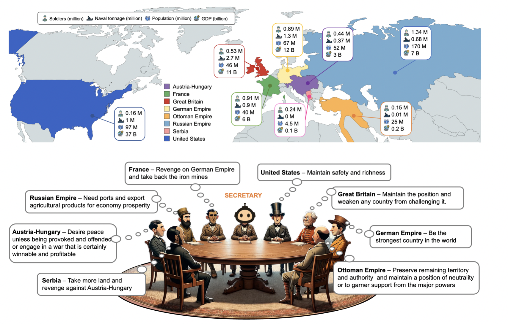
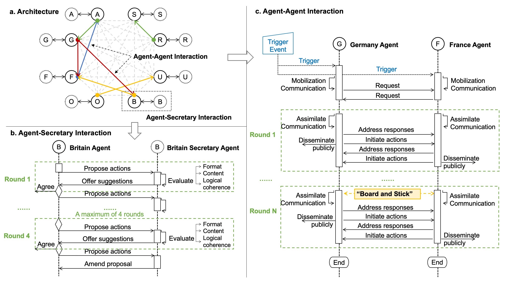

# War and Peace (WarAgent): Large Language Model-based Multi-Agent Simulation of World Wars

<a href='https://arxiv.org/abs/2311.17227'></a> 
[](https://github.com/agiresearch/WarAgent/blob/main/LICENSE)




**Can we avoid wars at the crossroads of history?**  
This question has been pursued by individuals, scholars, policymakers, and organisations throughout human history. In this research, we attempt to answer it by harnessing recent advances in Artificial Intelligence and Large Language Models (LLMs). 


## Overview

This project is forked from [agiresearch/WarAgent](https://github.com/agiresearch/WarAgent). Our updated approach includes:
- A more comprehensive agent-based modelling system.
- A fine-tuned model trained on historical war data.

By representing countries as dynamic agents with their own strategies, alliances, and resource constraints, WarAgent allows exploration of conflict scenarios on multiple levels—global, national, and tactical.

---

## Updates

### Advanced Agent Modelling
- Countries are now represented as autonomous agents with unique goals, resources, and decision-making processes.
- Agents adapt to changing environments, respond to emerging threats, and form alliances or rivalries that shape the unfolding scenarios.

### Fine-Tuned Historical Context
- The underlying model has been refined with data from historical conflicts, ensuring that the simulation outcomes reflect plausible real-world dynamics.
- Users can adjust parameters to explore counterfactuals or "what-if" variations of historical wars, examining how slight shifts in decisions or circumstances might alter history’s trajectory.

### Dashboards for Multi-Level Analysis
- **Global Dashboard**: Offers a strategic overview of all conflicts, alliances, and resource flows.
- **Country Dashboard**: Focuses on the internal conditions of a single nation, including morale, economy, and diplomatic relations.
- **Commander Dashboard**: Zooms in on tactical decisions and battlefield conditions, capturing the detail required for more granular analysis.

---

## Roadmap

1. **Launch of Public Dashboards**  
   - Our immediate next step is to make the dashboards accessible.  
   - Initially, users will be able to view simulations that we run, providing a transparent window into how agents interact and how conflicts unfold.

2. **User-Created Simulations**  
   - Following the public release of dashboards, we will enable users to craft their own scenarios.  
   - With custom parameters, users can test hypotheses, replay historical events under altered conditions, or invent entirely new geopolitical configurations.

3. **Custom Agent Models**  
   - As a subsequent step, we will begin replacing some country agents with our own specialised models.  
   - This will allow advanced users to integrate fine-tuned models to further refine outcomes and enhance realism.

---

## Potential Use Cases

### Government and Policy Analysis
- Policymakers and think tanks can run simulations to evaluate the impact of strategic decisions before implementation.  
- Shifting resource allocation, altering alliances, or modifying diplomatic approaches can reveal unexpected consequences, improving long-term planning and stability.

### Historical and Educational Research
- Historians, educators, and students can delve into "what-if" scenarios to understand the complexity of historical wars.  
- This interactive approach offers a richer understanding of the factors that drive conflict, allowing learners to engage with history at a deeper level.

### Academic Studies in Conflict and International Relations
- Researchers can test theories, identify patterns, and refine models by running repeated simulations.  
- The emergent dynamics can illuminate how systemic pressures or local triggers cascade into full-scale wars, offering insights that traditional analytical methods might miss.

### Military Training and Strategic Simulations
- Military academies and strategists can leverage the commander-level dashboard to practise decision-making under complex and evolving conditions.  
- By testing various tactics and logistical choices in a risk-free environment, war-gaming exercises become more nuanced and informative.

### Non-Profit and Global Organisations
- NGOs and international bodies can use the simulations to understand humanitarian crises, forecast the effects of interventions, sanctions, and peacekeeping efforts, and consider how best to mitigate suffering during conflicts.

---

## References and Sources

- Axelrod, R. (1997). *The Complexity of Cooperation: Agent-Based Models of Competition and Collaboration.*  
- Cederman, L.-E. (2003). *Modeling the Size of Wars: From Billiard Balls to Sandpiles.* American Political Science Review.  
- [Project on Computational Conflict Modelling](http://www.conflictmodelling.org/)


## WarAgent Architecture

- Country Agent & Country Agent Interaction: Each country agent is defined by its corresponding country profile. In each round, the agent reacts to the current situation by generating actions available from the action space.
- Country Agent & Secretary Agent Interaction: Each country agent employs a designated “secretary agent” to verify the appropriateness and basic logical consistency of their actions.
- Board and Stick: The Board is designed to manage international relationships and the Stick functions as an internal record-keeping system for each country that represents the domestic statutes.


## QuickStart
### install environment
```
conda create --name waragent python=3.9
conda activate waragent

git clone https://github.com/dhh1995/PromptCoder
cd PromptCoder
pip install -e .
cd ..

git clone https://github.com/agiresearch/WarAgent.git
cd WarAgent
pip install -r requirements.txt
```

### Set up API keys
If you want to use OpenAI model as base LLM:
```
export OPENAI_API_KEY=your_openai_api_key
```
If you want to use Claude model as base:
```
export CLAUDE_API_KEY=your_claude_api_key
```
### Run WarAgent simulation
Currently, WarAgent supports GPT-4 and Claude-2, two of the strongest large language models. The default choice is GPT-4.

To run the default setting (historically accurate setting):
```
cd src
python main.py --model 'your model choice: {claude-2, gpt-4}' --scenario WWI --present_thought_process
```

To use a different trigger event:
```
new_trigger = 'your trigger event'
python main.py --model 'your model choice: {claude-2, gpt-4}' --scenario WWI --present_thought_process --trigger new_trigger
```

### Demo
```
python main.py --model gpt-4 --scenario WWI --present_thought_process
```
link to [video](https://drive.google.com/file/d/1-0dh0Un72LhswMTiPsYn1xTb12xwjy08/view?usp=sharing) with a 5-minute demo using the above command


## News

-[2023.11.28] We release the initial version of WarAgent, including the source code, data, and evaluation metrics.


## License
The source code of WarAgent is licensed under [Apache 2.0](https://github.com/tatsu-lab/stanford_alpaca/blob/main/LICENSE). The intended purpose is solely for research use.

## Reference
```
@article{hua2023war,
      title={War and Peace (WarAgent): Large Language Model-based Multi-Agent Simulation of World Wars}, 
      author={Wenyue Hua and Lizhou Fan and Lingyao Li and Kai Mei and Jianchao Ji and Yingqiang Ge and Libby Hemphill and Yongfeng Zhang},
      year={2023},
      eprint={2311.17227},
      archivePrefix={arXiv},
      primaryClass={cs.AI}
}
```
